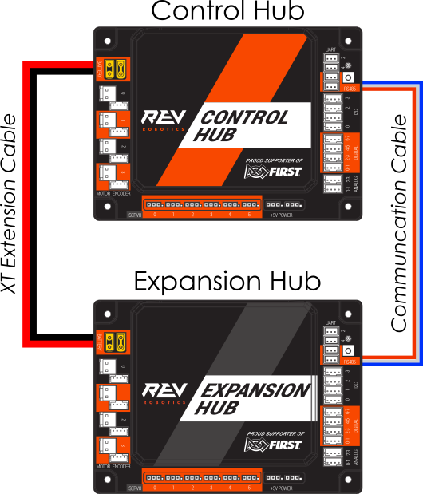

# St. Mark's FTC-A Decode Repo For Team 23381 "The Marksmen"

## ADB connect instructions

if `adb devices` doesn't show any devices:
1. close and reopen Android Studio
2. connect to driver hub using wifi
3. run `adb kill-server && adb start-server`
4. run `adb connect 192.168.43.1`
5. now try `adb devices`

it may take a second for the control hub to show up in Android Studio

## programming conventions

### units
- distance units:
  - hardware offsets: millimeters (easy to get from Onshape)
  - field distances: inches (used in Pedro Pathing)
- angle units:
  - limelight/vision: degrees
  - everything else: radians
- all speed units: TPS or radians/s
  - internal logic: TPS
  - human-facing: actual RPM of flywheel (accounting for ratio)

### odo distances
- robot length (back to front) is **420mm** / **16.53543"**
- robot width (left to right) is **400mm** / **15.74803"**

# hardware map

driver station config name: `v3`

## control hub

### I²C ports/buses

| port/bus  | device type            | location                    | verbatim name         |
|:----------|:-----------------------|-----------------------------|:----------------------|
| `0`       | *unused*               | *unused*                    | *unused*              |
| `1`       | Pinpoint Odo Computer  | left side under control hub | `odo`                 |
| `2`       | *unused*               | *unused*                    | *unused*              |
| `3`       | *unused*               | *unused*                    | *unused*              |

### digital ports

| port  | device type    | location               | verbatim name         |
|:------|:---------------|------------------------|:----------------------|
| `0`   | *unused*       | *unused*               | *unused*              |
| `1`   | Digital Device | side of turret         | `upperTransferSensor` |
| `2`   | *unused*       | *unused*               | *unused*              |
| `3`   | Digital Device | side of lower transfer | `lowerTransferSensor` |

the cable for upper transfer plugs into the `0/1` digital port, but the sensor must be configured as using `port 1`

the cable for lower transfer plugs into the `2/3` digital port, but the sensor must be configured as using `port 3`

### USB ports

| port    | device       | verbatim name |
|:--------|:-------------|:--------------|
| USB 3.0 | Limelight 3A | `limelight`   |

ensure Limelight is plugged into `USB 3.0`, not `USB 2.0`

after scanning, the Limelight will show up as `Ethernet Device` under the USB devices, make sure to rename it to the verbatim name

make sure to save the config with the Limelight under a new name, as scanning may delete other devices

### DC motors

| motor port  | motor type              | verbatim name | encoder? |
|:------------|-------------------------|:--------------|:---------|
| `0`         | GoBILDA 5202/3/4 series | `frontLeft`   | ❌        |
| `1`         | GoBILDA 5202/3/4 series | `frontRight`  | ❌        |
| `2`         | GoBILDA 5202/3/4 series | `backLeft`    | ❌        |
| `3`         | GoBILDA 5202/3/4 series | `backRight`   | ❌        |

make sure to connect every motor with the correct polarity; the reversing should is done in software

### servos

| servo port   | servo type       | verbatim name |
|:-------------|------------------|:--------------|
| `0`          | Full Range Servo | `hoodServo`   |
| `1`          | Servo            | `sorterServo` |
| `2`          | *unused*         | *unused*      |
| `3`          | *unused*         | *unused*      |
| `4`          | *unused*         | *unused*      |
| `5`          | *unused*         | *unused*      |

## expansion hub

### connection method (ports matter)

### I2C ports/buses

| port/bus | device type            | location       | verbatim name         |
|:---------|:-----------------------|----------------|:----------------------|
| 0        | REV 2M Distance Sensor | side of intake | `intakeSensor`        |
| 1        | *unused*               | *unused*       | *unused*              |
| 2        | *unused*               | *unused*       | *unused*              |
| 3        | *unused*               | *unused*       | *unused*              |

### DC motors

| motor port   | motor type              | verbatim name   | encoder?  |
|:-------------|-------------------------|:----------------|:----------|
| `0`          | GoBILDA 5202/3/4 series | `intakeMotor`   | ✅         |
| `1`          | GoBILDA 5202/3/4 series | `transferMotor` | ❌         |
| `2`          | GoBILDA 5202/3/4 series | `launchLeft`    | ✅         |
| `3`          | GoBILDA 5202/3/4 series | `launchRight`   | ✅         |

our turret encoder should be plugged into our intake motor encoder port, we should not have an encoder connected from the intake motor itself

`launchLeft`/`launchRight` are agnostic to which port each encoder is plugged into. As long as at least one has an encoder than PIDF will work

## servo hub

### connection method (ports matter)

### servos

| servo port   | servo type | verbatim name   |
|:-------------|------------|:----------------|
| `0`          | Servo      | `intakeServo`   |
| `1`          | Servo      | `transferServo` |
| `2`          | Servo      | `turret1`       |
| `3`          | Servo      | `turret2`       |
| `4`          | *unused*   | *unused*        |
| `5`          | *unused*   | *unused*        |

the connection order of turret1/2 doesn't matter, since they both face the same direction

# controller map

## sticks

### left stick

- **X**: move robot left/right
- **Y**: move robot forwards/back

the **start** button toggles between robot/field centric control

### right stick:

- **X**: rotate clockwise/counterclockwise
- **Y**: adjust hood in **manual** mode
  - don't forget to unlock hood with **left bumper**

## bumpers

- **left bumper**: lock/unlock hood/turret
- **right bumper**: launch 1ball

## triggers

- **left trigger**: slow mode 
- **right trigger**: *unused*

## buttons

### face buttons
- **A**: toggle intake
- **B**: toggle manual/automatic launch
  - **auto**: uses vision/odo to find out needed launch speed to reach goal
  - **manual**: sets launch speed to constant defined in Tunables.java (calibrated for shooting from crease)
    - the RPM setpoint can be changed with the d-pad buttons
    - the hood position can be adjusted by unlocking hood (**left bumper**) and moving **right stick Y**
- **Y**: launch 3 balls
- **X**: reverse intake

### d-pad
- **up**: increase launch RPM setpoint
- **down**: decrease launch RPM setpoint
- **left**: decrease launch RPM setpoint by half
- **right**: increase launch RPM setpoint by half

### other buttons
- **start**: toggle field/robot centric
- **back**: reset field centric heading
  - make sure to orient the robot towards the top of the field (in between the goals)

# OpModes

## TeleOp
- `Enable/Disable Panels`: enables/disables [Panels telemetry](http://192.168.43.1:8001/)
- `BlueTeleOp`: TeleOp for blue team
- `RedTeleOp`: TeleOp for red team

## Auto

### blue team

- `BlueTriAuto`: starting by bottom triangle
- `BlueGoalAuto`: starting by blue team goal

### red team

- `RedTriAuto`: starting by bottom triangle
- `RedGoalAuto`: starting by red team goal

## Util

- `FlywheelTuner`: tune flywheel PIDF
- `LaunchTuner`: tune launch delays
- `SensorTuner`: test/tune distance sensors and their trigger points
- `ServoTuner`: test/tune servo endpoints
- `TurnTest`: test Pedro Pathing turning behaviour
- `TurretTuner`: test/tune turret encoder and PIDF
- `VisionTest`: test/tune limelight

# state machines

## auto states

1. `START`
2. `TRAVEL_TO_LAUNCH`
3. `LAUNCH`
4. `TRAVEL_TO_BALLS`
5. `RELOAD`
6. `GO_TO_CLEAR`
7. `CLEAR`
8. `GO_TO_END`
9. `END`

### ball triplets scored
- starts at 0
- increments every launch

## launch states

1. `START`
2. `OPEN_UPPER_TRANSFER`
3. `RAISE_LOWER_TRANSFER`
4. `WAIT_FOR_SENSOR_HIT`
5. `WAIT_FOR_EXIT`
6. `WAIT_FOR_LOWER`
7. `WAIT_FOR_TRANSFER`

### balls remaining

- starts at 3 (all in robot)
- decrements by 1 every ball that is launched

# vision

We are using a Limelight 3A

## pipelines

| filename         | index  | allowed tag IDs | purpose                                       |
|:-----------------|--------|:----------------|:----------------------------------------------|
| `0_Obelisk.vpr`  | `0`    | 21,22,23        | detect pattern                                |
| `1_BlueTeam.vpr` | `1`    | 20              | get blue goal april tag distance and tx       |
| `2_RedTeam.vpr`  | `2`    | 24              | get red goal april tag distance and tx        |
| `3_FullPos.vpr`  | `3`    | 20,24           | get full positioning data from both goal tags |

pipeline files are saved in the [limelight folder](limelight/)

# telemetry

- Panels: [192.168.43.1:8001](http://192.168.43.1:8001)
- robot controller: [192.168.43.1:8080](http://192.168.43.1:8080/)
- Limelight video stream: [192.168.43.1:5801](http://192.168.43.1:5801/)
- Limelight control: [192.168.43.1:5800](http://192.168.43.1:5800/)